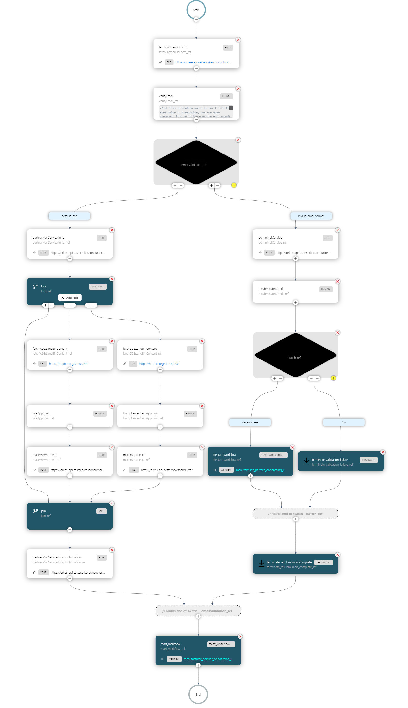
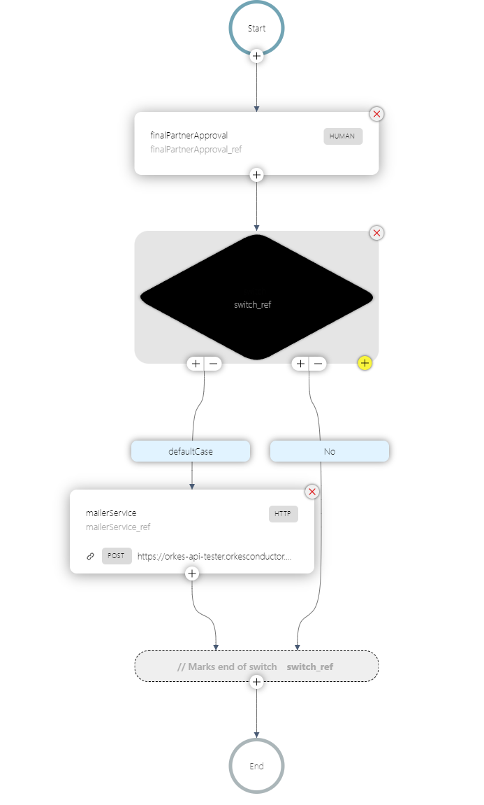

# Enterprise Onboarding Usecase

This repository contains a demo showcasing an automated partner onboarding workflow built using the Orkes Conductor platform. Designed for a manufacturing company, this solution addresses the need for a streamlined process to onboard trading partners, ensuring collaboration and integration.

## Set Up

To set up this demo in your Orkes Demo environment, create definitions for the respective `userForms` and `workflows` located in this directory.

Additionally, create an envioronment variable called `assignedUser`, and set it to your email address. This will be the user that is assigned all human tasks for approval in this demonstration.

Once complete, click Run Workflow and select the workflow named `manufacturer_partner_onboarding_1`. Pass initial form data as follows:
```json
{
  "firstName": "Thomas",
  "lastName": "Anderson",
  "email": "neo@matrix.com",
  "phone": "123-456-7890",
  "taxId": "123-45-6789",
  "w9FormDownloadUrl": "https://somehostingsystem.com/uploads/unique-file-id-w9.pdf",
  "complianceCertDownloadUrl": "https://somehostingsystem.com/uploads/unique-file-id-cert.pdf",
  "company": "Anderson and Co."
}
```

Feel free to make the `email` variable invalid by leaving out a `@` or `.` to demonstrate the error and retry workflow!

```json
{
  ...
  "email":"neo@matrixcom"
  ...
}
```

## Overview

The workflows should appear as follows in your environment. The leftmost image shows step 1 in the onboarding flow, where initial form data will be validated and go through a series of approvals. The rightmost image shows step 2 in the onboarding flow, where the partner details can be posted to an ERP table of partners for integration in various business processes within the enterprise.

<div style="display: flex; justify-content: center;">
  
  
</div>