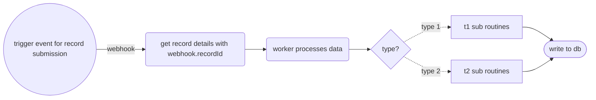

# Data processing example

This example worker processes data from a hypothetical event containing data from a SaaS application.

## Orchestration Process

```mermaid
graph LR
A((trigger event for record submission))--webhook-->
B(get record details with webhook.recordId)-->
C(worker processes data)-->
D{type?}
D-.type 1.->
E[t1 sub routines]
D-.type 2.->
F[t2 sub routines]
G([write to db])
E-->G
F-->G;
```
