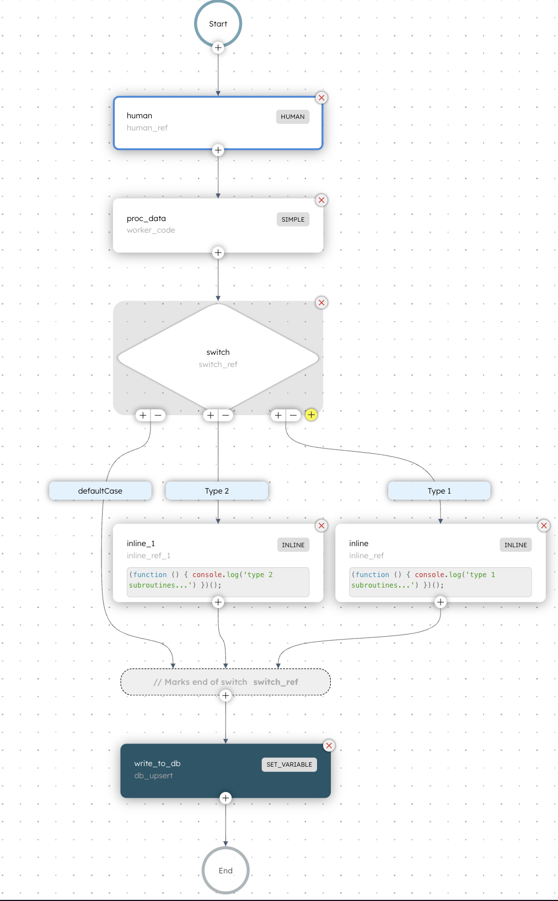

# Data processing example

This example of orchestration leverages several of Orkes native features, including Webhooks, User Forms, Worker Tasks, Switches and Inline Tasks. Note that this example uses the development environment and the `TOKEN` should be put into this script as an environment variable.

This workflow consists of two parts: the trigger function (`webhook`) and the `main workflow` that procs after a user form submission. Reference the `orkes_json` folder for JSON examples of all of the elements in this example.

## Orchestration Process Overview


## Webhook

The webhook in this example follows Orkes documentation and is set up with a simple match. Referece [Orkes Webhook documentation](https://orkes.io/content/templates/examples/custom-conductor-webhook-using-curl) for details. Whether submitting this test via a terminal or a client like Postman, ensure that the JSON matches the workflow input during testing.

Example workflow input params:
```json
{
  "type": "submission"
}
```

Matching body in API call:
```json
{
    "event": {
        "type": "submission"
    }
}
```

## Main Workflow
The main workflow that is triggered from the webhook creates a form for a user. The workflow waits for the response from the user form. Once the user completes the form, the form data is passed into a worker that creates a JSON payload of record detail.

Main payload function in worker:
```js
function createPayload(input, score, type) {
  return {
    id: input.id,
    type_id: input.type_id,
    type_label: type,
    score: input.score,
    failed: score,
  };
}
```

Based on the results from the payload, different steps of a workflow can be initiated. In this example, simple inline JavaScript functions are called to log a simple message:
```js
(function () {
    console.log(`${type_label} subroutines...`)
})();
```

These inline functions follow IIFE syntax.


### Images

<div style="display: flex; justify-content: center;">
  
  
</div>
