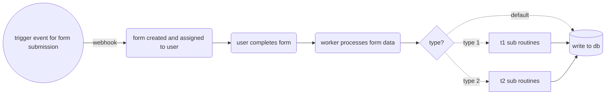
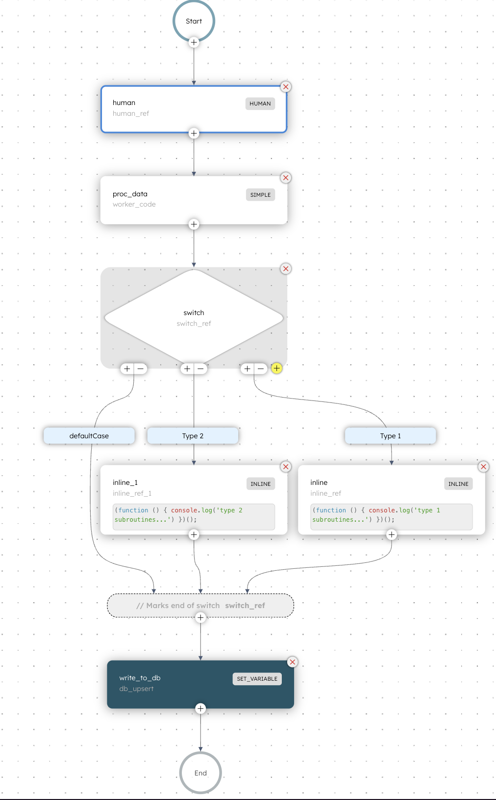
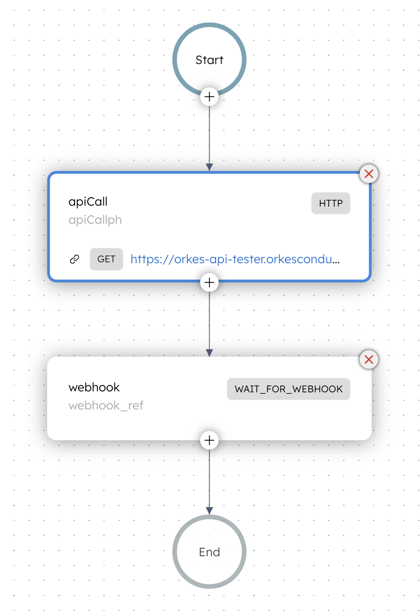

# Orkes Platform Orchestration Demo

This example demonstrates orchestration using several native features of the Orkes platform, including Webhooks, User Forms, Worker Tasks, Switches, and Inline Tasks. This example can be deployed in the the Orkes Conductor development environment.

## Set Up

- In your Orkes Conductor developer environment, create definitions for the respective `userForms`, `webhooks`, and `workflows` located in this directory.

- Create a `.env` file in the `workerSolution` directory, and add a `TOKEN` parameter. This token can be generated from the Orkes Conductor developer environment.

```bash
TOKEN=5b1d73376dhy2a92960a0171b...
```

Ensure all dependencies are installed by running `npm i` in your terminal.

## Using the Demo

Once the set up is complete, run the following command in the `workerSolution` directory:

```bash
node worker.mjs
```

This will ensure the worker is listening for testing the workflow in the Orkes Conductor developer environment. Simple logs have been added to show what the worker does to inputs.

Make the following API call from Postman, Insomnia, or the REST client of choice:

```curl
curl --location 'https://developer.orkescloud.com/webhook/6j4r7f7152b5-b3f4-11ef-9ee2-e66ef5be46e1' \
--header 'SomeKey5wvjd: Some-val-704z' \
--header 'Content-Type: application/json' \
--data '{
    "event": {
        "id": "Record 6789",
        "subType": "2",
        "score": 23
    }
}'
```

This should be a `POST` call.

The body passed in the payload can have varying data, but `subType` only accepts values `1` or `2`. There are human tasks in place so that the variables can be validated prior to being passed to the worker.

Once the API call is made, a human tasks will be created in the Orkes Conductor developer environment. This will need to be claimed and completed.

After the human task is complete, the worker will process the code and the workflow will complete.

## Orchestration Process Overview



## Webhook

The webhook in this example is configured using Orkes' documentation and does not leverage a match pattern. For more details, refer to the [Orkes Webhook documentation](https://orkes.io/content/templates/examples/custom-conductor-webhook-using-curl). 

## Main Workflow

The main workflow triggered by the webhook generates a user form and waits for the user’s response. Once the form is completed, the submitted data is passed to a worker, which processes it to create a JSON payload containing the record details.

Main payload function in worker:
```js
function createPayload(input, score, type) {
  return {
    id: input.id,
    subType: input.subType,
    type_label: type,
    score: input.score,
    failed: score,
  };
}
```

Based on the payload results, different workflow steps can be triggered. In this example, simple inline JavaScript functions log a message.
```js
(function () {
    console.log(`${type_label} subroutines...`)
})();
```

These inline functions follow IIFE syntax.


### Images

<div style="display: flex; justify-content: center;">
  
  
</div>
