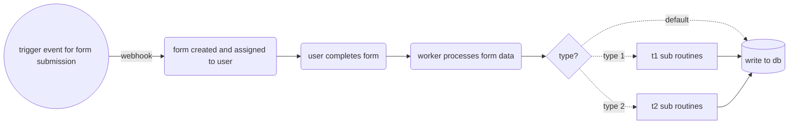

# Orkes Platform Orchestration Demo

This example demonstrates orchestration using several native features of the Orkes platform, including Webhooks, User Forms, Worker Tasks, Switches, and Inline Tasks. This example leverages the Orkes development environment.

## Set Up

Ensure that the `TOKEN` is securely stored as an environment variable in the directory of the script when executing the script.

```bash
TOKEN=5b1d73376dhy2a92960a0171b...
```

Additionally, ensure all dependencies are installed by running `npm i` in the directory of `worker.mjs`

## Workflow Overview

The orchestration is divided into two main parts:

1. Trigger Function: Initiates via a webhook.
2. Main Workflow: Executes after a user form submission.

For detailed examples of the JSON configuration files for each workflow element, refer to the `orkes_json` folder in this repository.

## Orchestration Process Overview



## Webhook

The webhook in this example is configured using Orkes' documentation and employs a simple match pattern. For more details, refer to the [Orkes Webhook documentation](https://orkes.io/content/templates/examples/custom-conductor-webhook-using-curl). 

### Testing the Webhook
You can test the webhook using a terminal or a client like Postman. Ensure that the JSON payload matches the expected workflow input defined in your configuration. Verify the webhook URL and the authentication token before testing.

Example workflow input params:
```json
{
  "type": "submission"
}
```

Matching body in API call:
```json
{
    "event": {
        "type": "submission"
    }
}
```

## Main Workflow

The main workflow triggered by the webhook generates a user form and waits for the user’s response. Once the form is completed, the submitted data is passed to a worker, which processes it to create a JSON payload containing the record details.

Main payload function in worker:
```js
function createPayload(input, score, type) {
  return {
    id: input.id,
    type_id: input.type_id,
    type_label: type,
    score: input.score,
    failed: score,
  };
}
```

Based on the payload results, different workflow steps can be triggered. In this example, simple inline JavaScript functions log a message.
```js
(function () {
    console.log(`${type_label} subroutines...`)
})();
```

These inline functions follow IIFE syntax.


### Images

<div style="display: flex; justify-content: center;">
  
  
</div>
